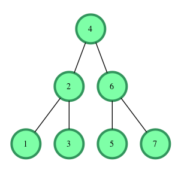

# Is Binary Search Tree
[](https://travis-ci.com/boivlad/isBinarySearchTree)

###[Is This a Binary Search Tree?(Task)](./is-binary-search-tree-English.pdf)
## How to test:
1. Clone this repository
2. `npm intsall`
3. `npm test`
## How to use:
1. Clone this repository
2. `npm intsall`
3. In your file `const { isBinarySearchTree } = require('../src/index');`
4. call `isBinarySearchTree` function with one object argument.
5. In result you will take result `true|false`. `True` if binary search tree is correct and `False` if incorrect.

Example object argument:
```json5
{
    value: 4,
    left: {
        value: 2,
        left: {
            value: 1,
            left: undefined,
            right: undefined,
        },
        right: {
            value: 3,
            left: undefined,
            right: undefined,
        }
    },
    right: {
        value: 6,
        left: {
            value: 5,
            left: undefined,
            right: undefined,
        },
        right: {
            value: 7,
            left: undefined,
            right: undefined,
        }
    }
}
```

